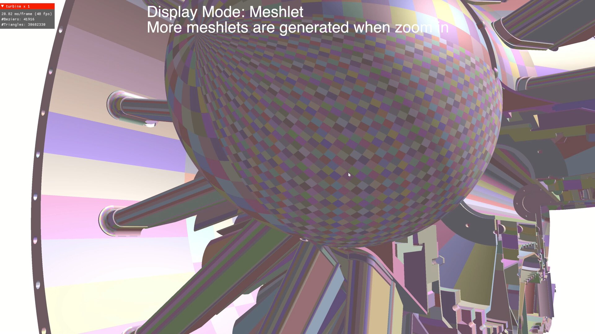

# step file viewer

我一直考虑做一个 [step](https://en.wikipedia.org/wiki/ISO_10303-21) file的viewer。 step file是一个通用开放的的cad数据交换标准。我本科读的是产品设计，使用过的涉及到曲面曲线造型的一些建模软件，可以导出/保存这种文件。我想做这个文件支持的另一个原因是有大量的cad数据，比如发动机，载具，齿轮，复杂机械，工业品都是采用这种格式，这种类型的场景很模型都非常精致，因为几何都是通过参数化曲面来定义的。

step是一个非常[复杂](https://www.steptools.com/stds/stp_expg/arm.html)的文件格式。格式本身通过一个称之为express的schema语言来描述，express是个比较复杂的schema描述语言。

## foxtrot step viewer

[foxtrot](https://github.com/Formlabs/foxtrot) 是一个 rust 编写的 step 文件loader。它实现了step file的解析，三角化和显示。这个项目我很久之前就star了，这个项目的[作者](https://github.com/mkeeter)是我最喜欢的程序员之一。

我把这个项目的代码里外看了一遍。对整个流程有个大致框架性的理解：

大致流程是：

- 编写parser解析 express schema描述文件（express crate）(是的，你得先编写spec的spec的schema的parser！)
- 解析用express编写的 step ap214标准，生成step file的parser（step crate）
- 用step file parser parse step文件
  - 读取场景parent和transform信息，构造场景树
- 读取几何相关数据，实现三角化（trianglulate crate），导出stl或者渲染
  - 读取常见的曲面曲线类型，可能有实现/支持不完全的情况

step中描述3d曲面造型信息，基本都是通过n个参数曲面+曲面上n个闭合曲线的裁切范围构成的。

闭合曲线可能是分段的，每一段有不同的曲线类型。曲线是3d空间中定义的。foxtrot实现曲面裁切，或者说实现这样裁切的3d参数化曲面显示的流程是：

- 在世界（或者local）空间离散化闭合曲线，得到vertex的loop。（这个线是可以直接用来做3d曲面边界显示的）
- 将上述vertex 投影（foxtrot中称之为lowing，反之rasing）到曲面的参数空间
  - 因为离散化误差或者本身几何的容差（是的，在曲面造型设计里，判断连接性都是靠容差判断的，他们数学上其实并不在一起，所谓的A级曲面设计只是容差控制非常严格（导致造型难度变高，可能需要更高次数的曲面来拟合来达成相关的连续性判断））。所以vertex其实并不在曲面上，所以其实是投影到参数空间中的最近点。
  - 一些简单曲面这样的lowing是可以简单计算/解析的计算的。对于nurbs曲面。fox的做法是对每一个nurbs曲面预计算8 x 8的离散点，然后找到最近的一个点开始用牛顿法来求解。。
- 投影到参数空间后，这些点集内部（其实fox的实现很粗糙，根本没有保证在border的内部，如果有问题直接删了重试罢了）插入一些点，这些点叫做steiner_point。很显然是要插入这些点的，不然这个曲面内部根本没有任何三角化。插入后在参数空间做带border限制的Delaunay三角化。然后在转化到世界空间的mesh

## 3d版vello

和foxtrot一样简单的转化为静态的三角形模型是比较传统的做法，但我理想中的stepviewer，其技术路线类似于一个3d版的[vello](https://github.com/linebender/vello)，动态的在gpu上自适应细分曲面，来解决cad场景：

- 能够无限放大曲面曲线细节而不会出现传统渲染方法因为离散精度不足，而导致显示质量不佳的问题
- 反之能够实现合理的LOD，大幅改进渲染成本，特别是在极其复杂的cad场景下具备显著性能优势

### 主要可行的技术路线

[ETER: Elastic Tessellation for Real-Time Pixel-Accurate Rendering of Large-Scale NURBS Models](https://dl.acm.org/doi/10.1145/3592419)

- 数据预处理 将高次nurbs曲面通过节点插入统一处理为有理bezier的patch
- 在gpu上自适应三角化bezier patch到网格
  - 采用tensor core来加速bezier patch的三角化
- 整体采用了比较先进的技术（visibility rendering，软件光栅化， meshlet）
- 曲面patch自动生成uv参数，uv参数映射回原nurbs曲面的参数空间
- 在fragment shader拿到的uv就是该曲面点在原nurbs曲面的参数空间位置信息，然后计算是否需要被裁减，如果裁减就discard
  - 裁减的算法应该有很多，该论文中使用的是 [Direct trimming of NURBS surfaces on the GPU](https://dl.acm.org/doi/10.1145/1531326.1531353)
  - 裁减的问题其实等价于2d矢量渲染，可能其他的算法也是可用的（比如slug）。裁减也涉及到参数空间裁减曲线的预处理（？）
- 不同patch面之间可能会有1像素宽度的缝隙：
  - 开启硬件保守光栅化，但不同patch有不同材质，边界的视觉质量就变差（锯齿）
    - 做法改进：同时光栅化保守和非保守，并且根据两张图像的depth，patch id，来决定采用哪一个结果。
  - 没有解决trim导致的缝隙问题
- 背景和其他信息：
  - siggraph 2023，close source
  - 和中科大相关
    - <http://staff.ustc.edu.cn/~lgliu/Projects/2023_ETER/default.html>
    - <http://gcl.ustc.edu.cn/>
  - 导师 刘利刚 <http://staff.ustc.edu.cn/~lgliu/>
  - 作者 Ruicheng Xiong
    - <https://dl.acm.org/profile/99660985955>
  - 作者 Cong Chen 的其他相关研究：
    - <https://orcid.org/0009-0007-3527-6313>
    - <https://www.linkedin.com/in/cong-alex-c-3a130611/>
    - 创业在做相关的工作 Sheyun Technology(设云科技) <http://lyteflow.cn/>

eter的演示视频里有显示的tessellation划分情况，每一个颜色小块是被tensorcore处理的7x7的网格：

看到这个我觉得似乎并不合理：

- lod过渡不连续，如果真如其说的能过保证1px的屏幕误差，那么其实有大量的部分是被过度三角化了。
  - 对于距离非常近面积非常大的patch，似乎以整个patch为单位计算保守的细分等级是不好的做法
- 过度三角化导致软件光栅化是必需的（小三角形太多了）

---

[WATER: Watertight Tessellation for Real-Time Pixel-Accurate Rendering of Large-Scale Surfaces](http://staff.ustc.edu.cn/~lgliu/Projects/2025_WATER/index.html)

- 上面的改进版（似乎是同一伙人做的），siggraph 2025，部分开源（shader，但是不确定是否是最新的）<https://github.com/Zeng187/WATER_public>
- 主要改进是去掉了tensor core的三角化（笑），提升了性能（还有其他一些消耗上的优化）
- 因为不再使用tensor core，所以不再要求 7x7固定的三角化网格，所以可以在边界区实现非均匀的对齐的三角化，以实现watertight
  - 边界区的宽度也是自适应计算的，所以实际上需要三角化的数量大幅下降（可能部分解决了上述我观察到的问题）
  - 采用taskshader来拆分子的三角化任务

---

[PaRas: A Rasterizer for Large-Scale Parametric Surfaces](https://dl.acm.org/doi/full/10.1145/3721238.3730658)

- 中科大，同一个实验室不同人做的，siggraph 2025
  - 导师 陈仁杰 <http://staff.ustc.edu.cn/~renjiec/>
- 采用了和上面两篇paper不同的做法，完全不做三角化
  - 直接通过数值方法从屏幕坐标反向迭代计算出uv
  - 迭代的初始点采用控制点mesh的的uv差值，这部分直接采用普通的图形管线加速
  - 对edgecase特别处理
  - 没有完善处理极端的edgecase，比如自相交的patch
- 对比eter有性能提升，但没有water实现改进的性能提升多
- 如果后续不考虑edgecase的完善处理问题，工程实现比eter和water要简单很多
- prototype开源：<https://github.com/renjiec/Paras>，似乎只包含triangle bezier曲面

---

一些分项技术点：

[The Cone of Normals Technique for Fast Processing of Curved Patches](http://www.abiezzi.com/Salim/publications/Docs/[Cone]%20v12i3pp261-272.pdf)

- ETER采用了此文中的做法来与计算每个patch的normal cone来做剔除

[Real-Time View-Dependent Rendering of Parametric Surfaces](https://dl.acm.org/doi/10.1145/1507149.1507172) 2009

- 这一篇是ETER引用的文献，ETER没有采用自适应细分而是uiform细分，声称即便这么做能够显著减少三角形数量，但是没有性能优势。
  - 我个人比较怀疑这个结论
- 阅读中几个confuse的点：
  - 文中的ur-patch，ur指的是“原始的，未经处理的”意思，并不是什么专有名词
  - DegreeElevatedPatch 的意思是将一个平面（可能并不是平面，比如4个点构成的类似平面的（中间控制点线性插值））用bicubic来表达，即插值成4x4的bicubic
    - 判断是否应该细分的逻辑，是被测试的bicubic face和这个bicubic face的四个顶点的DegreeElevatedPatch，每个控制点的距离是否足够小（全部足够小才不会进行下一步细分）。
  - 文中判断patch是否反向不可见，是通过计算4个角的normal方向来决定的（同时不可见则整个patch不可见），我一开始感觉不太合理，因为四个角的normal反向不可见，中间部分的依然有可能是可见的。后来才看到是对DegreeElevatedPatch来做的判断，所以只要有任何一部分是正向的，它的四个角法线就不可能同时指向背面。所以这个优化没有问题
- 细分/曲面拆分的方法是de Casteljau，就是beziercurve拆分的surface版本，参考 <https://zhuanlan.zhihu.com/p/6755322178> 。一层细分2x2。要么拆分四个子曲面，要么直接输出quad平面
- 曲面接缝是通过：根据边缘容差都满足条件后强制将控制点拍平来避免的，这么做文中承认会造成几何连续性下降，但是通过normal的正确计算来缓解。
- 文中说这种做法虽然保证了轮廓的精确性但是不能保证着色的精确性，我的理解是：着色的精确性还依赖于法线的正确性，现在的逻辑是：用来渲染的平面四边形，与原始曲面的位置偏差不超过0.5个像素，这样形成的插值精度不能保证法线是连续的（或者说被足够插值的）。我认为追求着色的正确性是非常高的难以满足的要求。
- 文中的细分循环，包括patch queue的维护，应该是通过多次dispatch实现的，所以实际上有最大细分深度限制。文中并没有详细讲解这部分工程实现的局限。

[Fast Rendering of Parametric Objects on Modern GPUs](https://www.cg.tuwien.ac.at/research/publications/2024/unterguggenberger-2024-fropo/unterguggenberger-2024-fropo-paper.pdf) 2024

- 和上文整体思路类似，并明确写明固定细分深度12
- 在拆分patch的过程中，采用（大量）32+ 32 + 25个sample来评估，具体分布见论文中的图
  - 利用subgroup加速，采用32是因为大部分主流平台32是32
  - sample数量给的多，毕竟文中一开始就“认为”，对于 “mordern gpu”的算力不是问题
  - 和上文重要的区别是，此文控制细分error的，是「每两个相邻点之间的屏幕空间距离」，而不是任何几何上的误差
    - 所以实际上他是直接保证某个patch，按照5x5细分，每一个1/5的子图元是次像素大小（不一定是像素大小，可以配置权衡）来保证显示的正确。
    - 所以即便一个平面/很平的曲面，依然会被细分到次像素大小
      - 所以他们特别做了一个基于point的软件光栅化来避免小三角形的性能问题
    - 这种方式直接保证了屏幕空间的采样率，所以能够直接保证着色（法线）级别的正确性，对参数曲面的数学性质也没有要求
- source code <https://github.com/cg-tuwien/FastRenderingOfParametricObjects>

[Efficient Pixel-Accurate Rendering of Curved Surfaces](https://www.cise.ufl.edu/research/SurfLab/papers/yeo12ani.pdf)

- 这一篇是ETER引用的文献，ETER主要援引了此文中对error的定义，并没有采用此文的算法，ETER paper的补充材料中指出，这篇文章有点bug，并且不适用于有理贝塞尔的情况。
- slefe
  - 概念：（Subdividable Linear Efficient Function Enclosures的缩写）
    - 对一个函数分段，每一段用不同的线性的上下界来包裹住函数的范围，这些线段是连续的。对于曲面采用上下界平面。
  - slefe-box： 三维情况下，slefe的分段点，有上界的四个平面和一个顶点，和下界的四个平面和一个顶点。这两个顶点构成的aabb称之为slefe-box
  - slefe-tile： 三维情况下，一段slefe就是一个6面体，称之为slefe-tile
  - slefe分段越多，对曲面的近似就越准确，slefe分段是预计算的
    - 文中提出细分每增加一倍，对曲面的近似误差就按照平方减少（出处和曲面的限定条件不详）
      - 根据此结论，通过计算slefe-box的屏幕空间投影，来反向推算出需要多少细分等级。
  - 前置研究： [Envelopes of Nonlinear Geometry](https://www.cise.ufl.edu/research/SurfLab/papers/99envthesis.pdf)
- opensource sample code: <https://github.com/sethk/PixAccCurvedSurf>

---

细分方面的成熟工业实现  <https://github.com/PixarAnimationStudios/OpenSubdiv>

- 参考文献<https://www.opensubdiv.org/docs/references.html>
- 只支持catmu和loop

#### 工程化方案

> 后续可能会实现上述技术方案，如有进展会整理于此

开发路线图规划：

- milestone 1 完成基本的曲面准备和测试环境
  - n阶nurbs曲面的数据类型定义
  - n阶有理贝塞尔曲面（以下简称B-data）的数据类型定义
  - n阶nurbs曲面到B-data的转换（节点插入法）
  - 其他step内常见的曲面到B-data的转化（optional）
  - B-data的cpu三角化实现（uniform）和rendiation viewer debug显示（用来做参照和基本fallback）
- milestone 2 gpu上的三角化实现mvp
  - 实现全局统一细分配置的 uniform 的三角化
    - 基本的dispatch 和draw流程
    - 迁移曲面求值逻辑到gpu
      - 评估高阶曲面的计算成本
- milestone 3 gpu上的自适应三角化实现mvp
  - TBD
    - 决定走eter方案，还是递归自适应方案，还是两个都做
    - mvp不做性能优化，不采用先进api，兼容性保证到webgpu标准

可以参考/利用的rust开源库（是比较有限的）：

- <https://github.com/mattatz/curvo> 包含nurbs的定义，cpu三角化，一些建模操作的实现（lofting, sweeping, revolving）
  - <https://docs.rs/curvo/latest/curvo/all.html#structs>
- <https://docs.rs/neco-nurbs/latest/neco_nurbs/struct.NurbsSurface3D.html>

### 其他可能的技术路线（之前个人思考的方向）

> 这部分没有有效结论，可全部跳过

#### 直接raytracing 参数化曲面（不太可行）

- [Raytracing with M-Reps](https://www.mattkeeter.com/projects/mrep/)
  - 结论：比三角化+bvh 再tracing性能慢很多
- [RAY TRACING PARAMETRIC PATCHES](https://dl.acm.org/doi/pdf/10.1145/800064.801287)

#### 直接考虑支持裁减

我个人判断支持参数空间的曲面裁减才是问题的困难之处，在我没有意识到可以直接在fragment shader做裁减之前，我试图直接在三角化或者曲面降级流程中直接支持裁减。

其中曲面降级过程中支持裁减：非常困难，没有讨论价值。

三角化过程中直接支持裁减：思路就是想办法直接将上述foxtrot的三角化实现做到gpu上，并且做到自适应。比较困难，相关的想法是：

input

- 某类curve的所有instance buffer
- boundary -> curve one-to-many buffer（ordered）
  - curve: (curve-type-id, curve-id)
- boundary -> surface-patch-id buffer
- surface-patch -> boundray-id + surface-id + bounding buffer
  - bounding可能并不方便精确计算，可采用较为保守的估计
- 某类surface的所有instance 及boundary reference
  - surface 不采用bounding进行剔除，因为border curve的剔除已经能够实现这一能力

output

- triangle mesh buffer

流程

- 所有surface-patch利用bounding信息，进入其他gpu 剔除管线进行预剔除得到visible surface-patch
- 计算visible curves，fanout（range二分查找）
- per visible curve 离散化
- per surface patch lowing curve离散化后的点到surface 参数空间
- per surface patch 三角化 参数空间的boundary
- 参数空间的mesh，自适应细分并输出到世界空间

缺失的待调研具体算法需求：

- gpu上的polygon(无自交，可能有洞，非凸，多个)三角化并行实现（有效的per vertex的并行） !blocking!
- 三角化细分的并行实现  !blocking!

性能风险

- 上述三角化相关算法的性能
- 高次曲面 lowing和raising 非常昂贵。每一帧全量生成很有可能顶不住
  - 是否可以在local部分采用简单的细分算法（正确性问题，接缝问题）
  - 可能要设计cache和渐近行为来避免全量生成（所以实际上整个体系是退化成gpu driven的渐近曲面mesh显示优化）
- curve和triangle继续细分的条件不明确，目前设想是差值点raising到world然后对比该点到旁边点线段/面垂直距离是否小于给定阈值
  - 可能要根据具体曲面类型来决定上述尝试的差值点个数和位置，比如大于两次的曲线，采用一个点判断很可能是错的。
- cad 类型的模型，内部结构是非常非常丰富的，所以以完整曲面进行剔除估计效果很差。而又很难找到一个曲面的子结构来做剔除。所以潜在要做的三角化可能会很多。

参考资料及搜索实现

- triangulation
  - foxtrot 是自己写的Delaunay
    - <https://en.wikipedia.org/wiki/Delaunay_triangulation> O(n log n)
    - <https://en.wikipedia.org/wiki/Constrained_Delaunay_triangulation>
  - 假设monotone的boundary O(n) 实现
    - <https://en.wikipedia.org/wiki/Polygon_triangulation>
  - refinement
    - <https://en.wikipedia.org/wiki/Delaunay_refinement>
  - gpu实现
    - <https://www.comp.nus.edu.sg/~tants/gdel3d_files/gDel3D.pdf>
    - <https://www.comp.nus.edu.sg/~tants/flipflop_files/flipflop.pdf> 「reading WIP」
      - <https://www.comp.nus.edu.sg/~tants/flipflop_files/flipflop-poster.pdf>
    - 先rasterize算voronoi图， 感觉不太好
      - [Computing 2D Constrained Delaunay Triangulation Using Graphics Hardware](https://www.comp.nus.edu.sg/~tants/cdt_files/TRB3-11-report.pdf)
      - [Computing 2D Delaunay Triangulation using GPU](https://www.comp.nus.edu.sg/~tants/delaunay2DDownload_files/cao_hyp_2009.pdf)
      - [Parallel Delaunay Triangulation](https://conniefan.github.io/DelaunayTriangulation/Parallel_Delaunay_Triangulation_on_CUDA.pdf)
    - <https://github.com/chenzhenghai/gDP2d>
      - 这个只是refinement过程是gpu的，初始的triangulation用的还是上面的做法
    - [2D Triangulation of Polygons on CUDA](https://ieeexplore.ieee.org/document/6641459)
      - 只是将per invocation 做独立的earcut， 没有参考价值
    - [A GPU Implementation of Dynamic Programming for the Optimal
Polygon Triangulation](https://www.cs.hiroshima-u.ac.jp/cs/_media/triangulation_ieice.pdf)
      - convex, 而且追求optimal，不太符合要求

[A three-dimensional parametric mesher with surface boundary-layer capability](https://www.sciencedirect.com/science/article/pii/S0021999114002447)

#### nanite

最后一种做法，就是生成足够高精度的mesh，然后全部预处理成mesh lod graph，做好虚拟化。虽然肯定可用，但这一做法不符合我们研究的主题

## 其他step的有用资源

[grabcad](https://grabcad.com/library?page=1&time=all_time&sort=most_liked)是一个cad file share的网站，上面有很多step格式的文件可以用来测试。

[step-tool](https://www.steptools.com/)是一个该文件格式相关的非官方网站，上面有step spec的细节（官方的iso文档几乎下载不到，购买的话价格非常贵）

另一个step and express rust parser[ruststep](https://github.com/ricosjp/ruststep)
