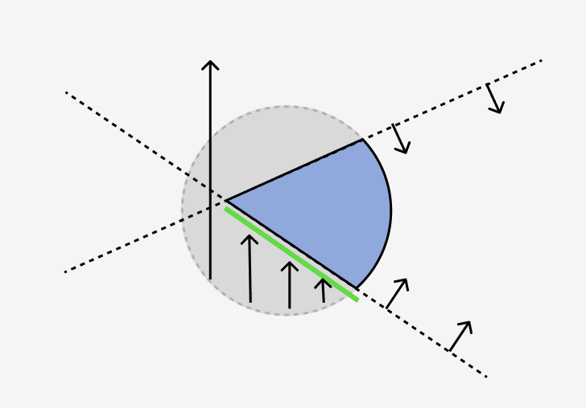
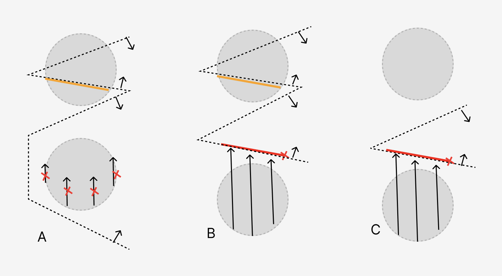

# Clipping effect

<!-- 本文图片原始编辑于 https://www.figma.com/design/oYwi8qazeQ6ejT2CKhU05o/Untitled?node-id=0-1&p=f&t=dpAQTN4e9lFdGXcI-0 -->

Clipping是一个CAD领域常见图形需求：用户设置多个clip元素，来剖分场景内容，以可视化场景内部细节。因为cad模型具有丰富的内部结构细节需要展示，clipping在cad领域是常见的需求。本文主要讨论clipping的实现方式。

## API的改进：用csg expression来表达clipping

在过去经手的渲染器实现，clipping做的其实非常简陋。用户设置一个clipping plane的array，shader中根据对这些plane的有向距离来discard fragment。

我认为应该采用CSG表达式来表达clipping。采用CSG表达式来表达clipping可以最为彻底的表达用户的clip需求，因为

- clip元素的组合方式，和组合顺序是灵活
  - 用户的超越array and的需求可以被自由表达
- clip元素的种类和组合的种类可以扩展实现
  - 可以实现球面，柱面等clip表面
  - 可以实现or/not 甚至其他运算符

通过csg来表达clip，实现clip的方式是简单的，和plane一样，我们只要计算当前fragment的位置，在用户给定的csg表达式的有向距离即可，凡是正数（或者负，根据具体的约定），那么该fragment就应该被discard。

从sdf这个角度看，我们可以不仅限于实现纯粹的csg表达式（and or not等运算符），实现复杂的clip形状blending等需求也是可能的。但非csg部分的运算符实现，可能会对某些feature（比如下文提到的补面）难以正确实现，所以我们只讨论csg的表达式。

### csg 表达式的device求值

csg 表达式需要在shader中求值（计算sdf），实现的方式是编写一个shader内的解释器。

简单构造一个shader内的栈来实现，栈存储于一个shader内private的临时array中。栈越大shader的寄存器占用越多，就可能性能会暴死。栈越小则能支持的用户的csg表达式越小（有暴栈的危险）。

求值一个csg表达式所需的栈大小， 即计算一个表达式的求值所需要的最大中间临时状态数量：<https://en.wikipedia.org/wiki/Strahler_number> “a numerical measure of its branching complexity”

理论上我们可以在shader中实现软件的spill逻辑（类似寄存器spill），但是实现复杂。目前配置一个简单的上限比如32是合理的工程选择。

## 补面需求

在cad领域，一般的场景物体是solid的，闭合的流形。这类物体被clip后，其存在一个良好的封闭的截面。在cad领域，显示这样的封闭截面信息是非常有用的功能，因为用户可以通过判断截面的填充信息来了解哪些部分是实体，哪些部分是空间，这对于用户的空间结构理解非常重要。

为了正确实现补面，我们要求场景物体都是空间上不相交的实体模型（watertight manifold）。或者我们需要用户标记场景中哪些物体是此类模型，只对这些物体执行补面计算。

### 补面的传统实现

<https://threejs.org/examples/?q=clip#webgl_clipping_stencil>

先开所有discard画场景。

再绘制每一个横截面，绘制方式是：

**per plane** 提取单个plane对场景的横截面，做法是 绘制开启双面，正面stencil-1，反面+1，最后stencil 1的部分就是需要补面的像素。

然后绘制plane mesh，plane mesh 开stencil和depth测试，并discard所有其他plane。

对于我们csg api来说，就是对每一个csg表面节点，提取对场景的横截面。提取方式为在csg表达式求值的时候，忽略该节点的影响。并且这种做法显然只支持csg类型的组合节点。

这个实现的开销是很高的，如果csg表面节点的数量为n， 那就是 n + 1 倍的场景pass。

### ray marching 补面的实现，和两种补面类型

raymarching补面是我尝试的一个不需要n+1倍pass的实现。但是这个实现不能保证正确性。并且有一些问题不好解决。这里做一个介绍。

补面需要在场景主pass（包含clip discard）中，保存三份depth buffer。分别是clip depth（即原生depth），和最近的正面不考虑discard的前表面深度（这份深度可以通过atomic buffer/imgage来获得）。

#### 补截面

如果物体的前面被clip，但是暴露了后面，那么这种情况称之为截面补面。这是主要的补面类型。

实现方式是从物体的反面向相机方向march ray，直到hit到边界。边界是一定能hit到的，hit到的边界就是要补的面。反面到hit点之间一定是连续的实体，因为我们在光栅化的过程中保留的是最近的反面。

#### 补悬空面

如果物体的前后面都被clip掉，但是clip的部分是可见的，那么这种情况称之为悬空面补面。简单的case比如从切面看一瓣西瓜。

这种case，是难以正确实现的。

简单的想法是记录物体未clip的前表面，然后向远离相机的方向trace，直到hit到边界，如果hit 不到边界，说明不需要补面。然而如果hit 到边界，并不一定需要补面，因为**你无法确定hit到的边界是否处于实体内部。**

进一步的，有大约以上这三种edgecase，A： 应该补，但是因为前表面位于被clip区域内，无法march，导致无法补。 B：被trace到的边界不在实体内，导致补面位置错误（还有更远的clip截面），C：被trace到的边界不在实体内，导致不应该补的被补上了。

如果要正确实现悬空面的补面，需要物体每一个表面的depth信息, 和可以trace到的所有截面深度，其中距离相机最近的且在表面内的截面才是正确截面。在single pass的补面算法中，存储和计算这些信息的成本是高昂的，性能开销也是高昂的。（可能对比mutli pass的depth peeling相对来说还是cheap的）

多pass的算法，有点类似于depth peeling，把每一个clip形状表面的的depth都计算出来了，所以没有这个问题。

<!-- 或者需要每一个clip表面的depth信息，TODO -->

#### 误差问题造成的artifact

raymarching一个众所周知的问题，就是对于平面来说，在glazing angle 无法march到真正的表面。这导致在glazing angle 补不上面。

另一个问题是raymarching是一个迭代的数值方法，其产生的表面，特别是曲面，上面的depth连续性很差，并且呈现锯齿状的波纹。因为normal是根据depth计算的，所以这导致后续的着色质量也有问题。

#### 性能问题

raymarching需要反复对expression进行求值，而求值是解释器实现，实际上性能表现很差。

### raytracing csg

可以用raytracing解决ray marching的效果问题，但是这么做就无法支持某些非csg操作的sdf节点。并且实现比较复杂。

<https://www.doc.ic.ac.uk/~dfg/graphics/graphics2008/GraphicsSlides10.pdf>

[GPU-optimized Ray-tracing for Constructive Solid Geometry Scenes](https://www.graphicon.ru/html/2016/papers/Pages_490-493.pdf)

## pick需求

### 截面pick问题

理想的行为是：对于不开启补面的情况，截面pick应该剔除被clip的部分。如果开启补面，补面需要能够被pick，并且识别到正确物体。

无论是gpu pick还是cpu pick，要实现上述需求，基本都需要模拟渲染的行为。

对于gpu pick，需要在补面时，同时在entity id buffer补面。

对于cpu pick，实际上要实现对csg 表达式的ray marching/ray tracing，否则无法正确支持悬空面的pick。

## 其他考虑

遮挡剔除:

- 其实只依赖depth信息，所以是可以work的
  - 简单实现的话，可以不考虑实现fill face的遮挡
- 对于multi pass来说
  - 简单实现的话，我们在补面pass不使用遮挡剔除，这会导致补面pass更加昂贵

补面材质的实现：

补面可以支持使用被clip的物体的材质。实现方法可以是可以通过entity id buffer补面的结果，反查material信息，和defer rendering一样实现光照。
